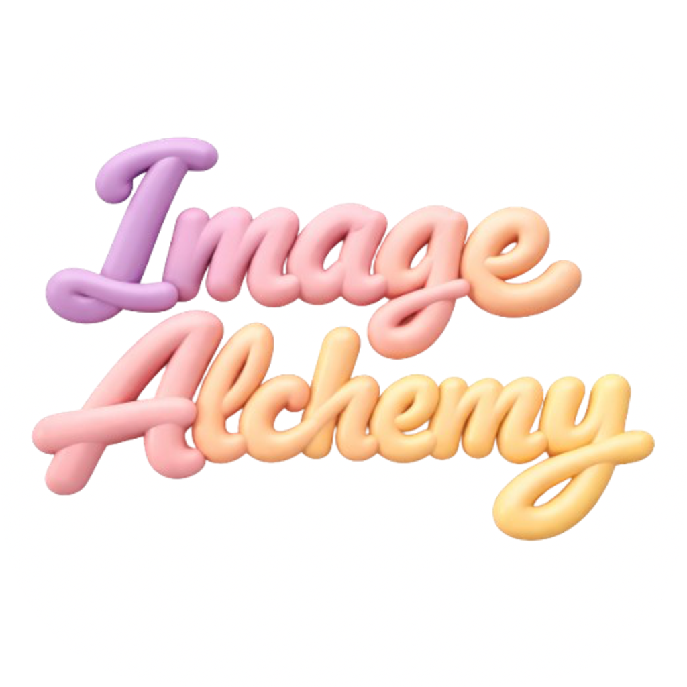

<div align="center">
  

  # Image Alchemy

  **Watch a diffusion model think.**

  An interactive iPad playground for understanding diffusion models through visual experiments, mathematical intuition, and on-device learning.
</div>

## Overview

Image Alchemy turns the diffusion pipeline into something learners can see, manipulate, and revisit. Rather than presenting image generation as a black box, the app breaks the process into visual stages: an image is encoded into a latent representation, noise is added over time, a denoiser predicts the noise to remove, conditioning guides the result, and a decoder reconstructs an image.

The project is designed as an educational experience, not as a production text-to-image generator. Its emphasis is understanding the ideas behind modern diffusion systems through interaction.

## Learning paths

### Full pipeline

The Architecture Overview presents the end-to-end flow and lets learners move through the major components of a latent diffusion system:

1. **Original image** — begin with an image in pixel space.
2. **VAE encoder** — see how an image can be compressed into a lower-dimensional latent representation.
3. **Latent space** — explore the structured grid of latent values and how it represents visual information.
4. **Forward diffusion** — progressively add Gaussian noise until the signal is obscured.
5. **Conditioning and guidance** — inspect embeddings, noisy latents, the denoiser, noise prediction, and guidance scale.
6. **Reverse diffusion** — step through iterative denoising from noise toward a clean latent.
7. **Decoder reconstruction** — follow the latent back into image space.
8. **Generated image** — connect the reconstructed output to the complete pipeline.

The pipeline includes draggable and scalable architecture views, selectable components, step navigation, reset controls, explanatory bottom sheets, latent-grid heatmaps, and 3D-style chart visualizations.

### Related mathematics

The Related Maths section builds the concepts needed to understand the equations behind diffusion models. It includes interactive views for:

- Probability basics and distributions
- Random variables
- Vectors and dot products
- One-dimensional and bivariate Gaussian distributions
- Noise schedules, timesteps, beta values, alpha values, and cumulative alpha products
- Forward diffusion equations
- Reverse diffusion equations and animated steps
- Loss functions, training progress, and loss landscapes
- Latent-space exploration

Controls such as timestep selectors, mean and standard-deviation adjustments, schedule parameters, equation-part highlighting, training animation, landscape ruggedness, and 2D/3D view switches are implemented as SwiftUI state so learners can immediately see how a change affects the visualization.

### Test your knowledge

The Knowledge section turns exploration into practice with four modes:

- **Flashcards** — flip through terms and definitions.
- **Match the Following** — connect concepts with their definitions across two columns.
- **Quiz** — answer generated multiple-choice questions.
- **Fill in the Blanks** — complete short explanations by selecting missing terms.

The knowledge experience shares a `KnowledgeSession` and dedicated view models so progress and generated content can be reused across modes.

## On-device Foundation Models

The Knowledge section uses Apple’s `FoundationModels` framework through `SystemLanguageModel.default` and `LanguageModelSession`. Separate sessions generate flashcards, quizzes, matching pairs, and fill-in-the-blank content using structured Swift models.

The app:

- Prewarms the language-model sessions when the Knowledge section opens.
- Checks `SystemLanguageModel.default.availability` before each generation request.
- Streams structured results so completed cards or questions can appear progressively.
- Uses prompts focused on diffusion models, latent spaces, denoising, U-Nets, schedules, conditioning, sampling, and related mathematics.
- Keeps model-generated learning content on the device; no application server is required.

If Foundation Models is unavailable on the selected iPad, generation is stopped and the service reports that the on-device model is unavailable instead of attempting a network fallback. Availability depends on the device, OS configuration, and Apple Intelligence/Foundation Models support.

## App flow

On first launch, `ContentView` presents the onboarding experience and stores completion in `AppStorage`. After onboarding, the app enters the home screen, where learners can open the Full Pipeline, Related Maths, or Knowledge paths. The home screen also includes appearance controls, help content, and project information.

The interface supports both portrait and landscape layouts on iPad. Knowledge cards use a two-by-two grid in portrait and a four-card horizontal layout in landscape. Navigation is built with SwiftUI `NavigationStack` and `NavigationSplitView` patterns appropriate for the iPad experience.

## Technology and architecture

- **SwiftUI** — views, navigation, sheets, state, animations, adaptive layouts, and appearance preferences.
- **Swift 6** — application and package language mode.
- **Metal** — custom shader work for the onboarding ripple effect and GPU-friendly visual experiences.
- **Swift Charts** — chart-based schedule, latent, and progress visualizations.
- **Foundation Models** — structured, streaming, on-device educational content generation.
- **Canvas and Shapes** — dotted backgrounds, arrows, architecture diagrams, heatmaps, and custom equation visuals.
- **Swift Package app structure** — the app is defined by `Image_Alchemy.swiftpm/Package.swift` and uses an executable target named `AppModule`.

The codebase is organized into a small set of clear layers:

```text
Image_Alchemy.swiftpm/
├── Components/       Reusable diagrams, equations, cards, charts, and layout primitives
├── Models/            Pipeline, architecture, maths, home, and knowledge data models
├── Services/          Gaussian sampling and Foundation Models generation
├── ViewModels/        State and interaction logic for each learning area
├── Views/             Onboarding, home, pipeline, maths, and knowledge screens
├── Media.xcassets/    App icons and image assets
├── ContentView.swift  Onboarding-to-home application flow
├── MyApp.swift        SwiftUI app entry point
└── Package.swift      iPad application and package configuration
```

## Requirements

- Xcode with iOS 26 SDK support
- iPadOS 26 or later
- Swift 6
- A compatible iPad with Foundation Models/Apple Intelligence support for generated learning activities

The application is configured for iPad only through `supportedDeviceFamilies: [.pad]`.

## Getting started

1. Clone or download this repository.
2. Open `Image_Alchemy.swiftpm` in Xcode.
3. Select a compatible iPad running iPadOS 26 or later.
4. Build and run the `Image Alchemy` app.
5. Complete onboarding, then choose a learning path from the home screen.

For Foundation Models features, use a supported iPad with the required Apple Intelligence configuration. Open the Knowledge section and confirm that the generated activities load locally. The app performs its own availability check and will show an error path when the local model cannot be used.

## Design principles

Image Alchemy is built around three principles:

1. **Make invisible processes visible.** Noise, latent values, schedules, vectors, and loss are rendered as things learners can inspect.
2. **Connect equations to behavior.** Interactive controls show how mathematical terms change the visual result or chart.
3. **Encourage curiosity before memorization.** Learners can move through the pipeline, open explanations, experiment with parameters, and then test their understanding.

## Privacy and connectivity

The core educational experience is local. Diffusion concepts, mathematical visualizations, animations, and knowledge-session prompts live in the app. Foundation Models generation is designed to run on-device, with availability checked before use and no server-side generation path implemented.

## Roadmap

Future learning modules may cover transformer architectures, attention mechanisms, richer latent-space experiments, GANs, guided lessons, and additional interactive AI concepts. The long-term goal is a broader visual learning platform for modern machine learning.

## License

Image Alchemy is available under the [MIT License](LICENSE).
